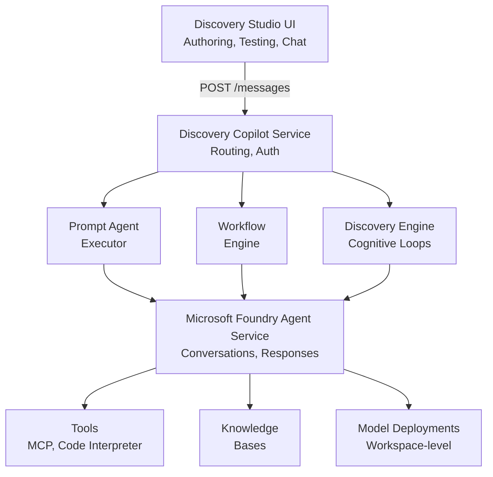

# Microsoft Discovery Agent concepts

Microsoft Discovery Agents are AI assistants that execute scientific research tasks on your behalf within the Microsoft Discovery platform. Discovery agents build on [Microsoft Foundry Agent Service](/azure/foundry/agents/concepts/runtime-components). They add scientific research features to conversational AI. These features include reasoning loops, agent teams, research tools, and knowledge bases.

Agents serve as the fundamental building blocks for automating complex scientific workflows. You define their behavior through natural language instructions, enabling sophisticated reasoning and decision-making without writing code. You create and manage agents through **Discovery Studio**, the primary authoring interface.

## Prerequisites

- Access to Microsoft Discovery platform
- A Discovery project in your workspace
- Basic understanding of AI and large language models

## Agent evolution from V1 to V2

Discovery Agent V2 represents a fundamental redesign of agent architecture. The evolution addresses key limitations while aligning with Microsoft Foundry Agent Service.

### Key architectural changes

| Aspect | Agent V1 | Agent V2 |
| --- | --- | --- |
| **Agent management** | ARM resources on control plane | Data-plane resources via Discovery APIs |
| **Workflow model** | State machine with events and transitions | Action flow with explicit control structures |
| **Agent selection** | Fixed entry point per project | Per-message `@AgentName` routing |
| **Workflow as resource** | Separate resource type | Workflows are agents with `kind: workflow` |
| **Versioning** | Mutable definitions | Every change creates new version |
| **Model deployment** | Platform-created with no configuration | Workspace-level shared deployments |
| **Authoring** | YAML files and ARM templates | Discovery Studio UI with YAML export |
| **Agent invocation** | By reference in state machine | By name in workflow actions |

### Benefits of V2

Agent V2 addresses several limitations of the previous architecture:

- **Flexible workflows**—V1 required defining all states upfront with rigid event-based transitions. V2's action flow model supports conditional logic, goto statements, and nested branching for more natural workflow expression.

- **Data-plane management**—Moving from ARM resources to data-plane APIs enables faster iteration and simpler agent lifecycle management.

- **Version history**—V2 enforces immutable versioning, allowing you to audit changes and roll back to previous versions.

- **Dynamic routing**—Unlike V1's fixed entry points, V2 lets you address any agent directly via `@AgentName` tags in conversations.

## Agent types

Discovery supports two primary agent types, both managed through the same APIs.

### Prompt agent

A prompt agent wraps a single large language model (LLM) invocation with system instructions, structured inputs, tools, and knowledge bases. Prompt agents handle specialized tasks and can operate independently or as components within workflows.

**Use prompt agents for:**

- **Specialized research**—Operating specific scientific tools or domain models, such as molecular dynamics simulations
- **Planning and coordination**—Generating research plans, making routing decisions, or summarizing results
- **Data operations**—Interacting with storage assets, running computations, producing scientific outputs

### Workflow agent

A workflow agent orchestrates multiple prompt agents through a defined sequence of actions. Workflows are agents with `kind: workflow`, not a separate resource type.

**Use workflow agents for:**

- **Multi-step research**—Pipelines requiring multiple specialized agents collaborating in sequence
- **Iterative refinement**—Feedback loops where agents evaluate and improve each other's outputs
- **Human-in-the-loop processes**—Workflows that pause for user confirmation or input

This architecture maps to the [Microsoft Foundry workflow concept](/azure/foundry/agents/concepts/workflow), providing sequential execution, human approval gates, and conditional routing patterns.

## Prompt agent components

Every prompt agent consists of core components you configure through Discovery Studio.

### Name and description

The agent name serves as a unique identifier within your project scope. You use this name to:

- **Invoke agents directly**—Type `@AgentName` in chat to route messages to specific agents
- **Reference in workflows**—Workflow agents invoke prompt agents by name
- **Discover capabilities**—Names appear in Discovery Studio and help routing agents make delegation decisions

The description provides a short summary of the agent's purpose, visible in the UI and used by other agents to understand capabilities.

### Instructions

Instructions are natural language prompts that define your agent's behavior, persona, and reasoning approach. This component determines how the agent interprets inputs, uses tools, and generates outputs.

**Effective instructions should:**

- Specify the agent's role and boundaries clearly
- Describe expected output format
- Include relevant domain context and constraints
- Reference workflow context when operating as part of a team
- Stay under 32,000 characters

### Model selection

The AI model powers your agent's reasoning. Discovery supports workspace-level model deployments shared across all project agents. **GPT-5.2** is the recommended model for all Discovery agents and is available in all production regions.

GPT-5.2 provides robust capabilities for both tool-heavy operations and advanced reasoning tasks, including:

- Reliable tool execution for agents that frequently invoke tools, run computations, or call APIs
- Enhanced reasoning for planning, summarization, literature review, and analysis tasks
- Consistent performance across scientific workflows

You can also deploy models from the [Foundry model catalog](https://ai.azure.com/catalog/models) at the workspace level and reference them by deployment name.

### Response controls

Two parameters control model response characteristics:

- **Temperature** (0–2)—Lower values produce deterministic outputs; higher values increase creativity. Use `0` for routing and planning agents requiring consistent behavior.

- **Top-P** (0–1)—Controls nucleus sampling diversity. Use lower values for precision tasks; higher values for exploratory or creative tasks.

### Structured inputs

Structured inputs define typed parameters your agent accepts from callers or workflows. Each input specifies:

- **Name**—Variable name referenced in instructions using `{{variableName}}` syntax
- **Description**—Explains what the input provides
- **Required**—Whether the input must be supplied at invocation
- **Default value**—Optional fallback when not provided

When workflow agents invoke prompt agents, they map workflow variables to structured inputs through argument bindings.

### Structured output

Configure agents to return structured JSON instead of free-form text. This capability is essential when outputs need programmatic parsing, such as:

- Router agents returning next agent selections
- Critic agents returning evaluation scores
- Data processing agents returning structured results

Define the expected output schema using JSON Schema format.

### Tools

Tools extend agent capabilities beyond language generation. Discovery supports several tool types:

| Tool Type | Description | Configuration |
| --- | --- | --- |
| **Discovery Tools** | Domain-specific scientific workflow and data operation tools | Discovery UI |
| **Code Interpreter** | Executes Python code with scientific libraries like RDKit | Foundry UI |
| **MCP Tools** | Connects to Model Context Protocol servers for dynamic tool discovery | Foundry UI |
| **Built-in Foundry Tools** | Standard tools including file search and web search | Foundry UI |
| **Custom Functions** | User-defined Azure Functions or API endpoints | Foundry UI |

Discovery provides **system pre-integrated tools** available to all agents by default:

- **Get Data Context**—Retrieves metadata about linked data assets
- **Preview Data**—Inspects data asset content with commands like `cat`, `head`, `ls`
- **Promote to Outputs**—Converts system-created assets to user-accessible assets
- **Save File**—Saves generated content as data assets

You can disable these tools for agents that don't need data handling, such as pure reasoning or routing agents.

### Knowledge bases

Knowledge bases provide retrieval-augmented grounding, allowing agents to access domain-specific information beyond the model's training data. Create knowledge bases at the subscription level and attach them to agents by reference. It enables agents to answer questions with factual, current information grounded in your specific documents and datasets.

## Workflow agent components

Workflow agents orchestrate prompt agents through an **action flow**—a declarative sequence of actions with control logic.

### Trigger

Every workflow begins with a trigger that defines when execution starts. The standard trigger is `OnConversationStart`, which fires when a user sends a message to the workflow agent. The trigger contains the sequence of actions to execute.

### Actions

Actions are workflow building blocks that execute sequentially. Control flow actions enable branching and loops.

| Action | Purpose |
| --- | --- |
| **ParseValue** | Extracts typed data from messages into structured records |
| **SetVariable / SetMultipleVariables** | Initializes or updates workflow variables |
| **SendActivity** | Sends status messages to users during execution |
| **InvokeAzureAgent** | Invokes prompt agents by name with argument bindings |
| **Question** | Asks users questions and pauses for responses (human-in-the-loop) |
| **ConditionGroup** | Provides if/else branching based on variable expressions |
| **GotoAction** | Jumps to previous actions by ID for bounded iteration loops |
| **EndConversation** | Terminates workflow execution |

### Variables

Workflows use a two-scope variable system:

- **`Local.*`**—Workflow-scoped variables persisting for execution duration. Used for iteration counters, intermediate results, agent outputs, and context passing.

- **`System.*`**—Platform-provided read-only variables including:
  - `System.LastMessage.Text`—The last user message
  - `System.ConversationId`—Current conversation identifier

Variables support expressions like `=Local.CurrentIteration + 1` and can hold strings, numbers, booleans, and structured records.

### Agent invocation

The `InvokeAzureAgent` action delegates work to prompt agents. It specifies:

- **Agent name**—The prompt agent to invoke by name, not resource ID
- **Input arguments**—Maps workflow variables to the agent's structured inputs
- **Output capture**—Captures responses in two forms:
  - `responseObject`—Structured JSON output for programmatic use
  - `messages`—Text output, optionally streamed to users via `autoSend: true`

### Orchestration patterns

Workflow agents support common orchestration patterns from [Microsoft Foundry workflows](/azure/foundry/agents/concepts/workflow):

| Pattern | Description | Use case |
| --- | --- | --- |
| **Sequential** | Passes results from one agent to the next | Step-by-step pipelines, multi-stage processing |
| **Human in the Loop** | Pauses for user confirmation or input | Approval gates, plan review, data collection |
| **Conditional Routing** | Branches to different agents based on context | Dynamic expert selection, adaptive workflows |
| **Iterative Loop** | Repeats segments until conditions are met | Refinement cycles, multi-round validation |

## Agent architecture

Discovery agents build on Microsoft Foundry Agent Service with scientific discovery extensions:

### Key architectural principles

- **Immutable versioning**—Every agent update creates a new version. Previous versions are preserved for audit and rollback.

- **Project binding**—Agents reference a `projectResourceId` at creation. Projects don't maintain agent lists; agents declare their project affiliation.

- **Workspace-level models**—All agents in a project share model deployments defined at the workspace level.

## Authoring in Discovery Studio

Discovery Studio provides the primary interface for creating and managing agents through visual configuration.

**Agent creation workflow:**

1. **Create a Discovery project**—All agents are scoped to a project
2. **Create prompt agents**—Configure name, instructions, model, tools, and knowledge bases through forms
3. **Create workflow agents**—Use the visual workflow builder or YAML editor to define action flows
4. **Test interactively**—Use the Foundry playground or test through Discovery Studio chat using `@AgentName` tags
5. **Iterate**—Each save creates a new immutable version with full history

## Related content

- [Microsoft Foundry Agent Service](/azure/foundry/agents/concepts/runtime-components)
- [Microsoft Foundry workflows](/azure/foundry/agents/concepts/workflow)
- [Foundry model catalog](https://ai.azure.com/catalog/models)
