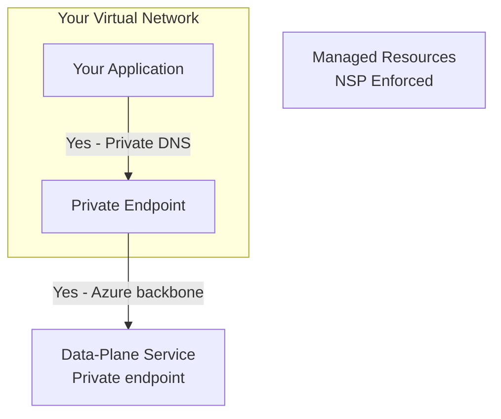

# Network security for Microsoft Discovery

Microsoft Discovery provides two layers of network security to protect your workspace resources and data-plane traffic:

| Layer | What it protects | How it works |
|-------|-----------------|--------------|
| **Network hardening** | Managed resources — databases, storage, AI services, and other backend services | Network Security Perimeters (NSP) and private endpoints restrict access to authorized Discovery components only |
| **Private endpoints** | Workspace and bookshelf data-plane APIs | Azure Private Link routes API traffic through the Azure backbone, eliminating public internet exposure |

Network hardening is enabled by default for all new workspaces. Private endpoints for data-plane access are optional and can be configured separately.

> [!NOTE]
> The `networkIsolation` tag is a temporary mechanism during internal milestones. Network hardening is enabled by default in public Preview, and the tag is longer be required.

## Why network security matters

When you create a Microsoft Discovery workspace, the service provisions managed resources (databases, storage accounts, AI services) on your behalf. Without network isolation, these resources have public endpoints and your data-plane API traffic traverses the public internet.

Enabling network security provides:

- **Data protection** - All traffic stays on the Azure backbone network, never traversing the public internet.
- **Compliance** - Meet regulatory requirements for network isolation and private connectivity.
- **Reduced attack surface** - Managed resources are accessible only to authorized Discovery service components.
- **Defense in depth** - Combines network perimeters, private endpoints, virtual network injection, and identity-based access control.

## Before and after comparison

### Before: Default deployment (no network isolation)

 ```mermaid
graph TB
    Client["Client / Application"] -->|"No - Public internet"| DP["Data-Plane Service<br/>Public endpoint"]
    DP -->|"No - Public access"| MRG["Managed Resources<br/>Public endpoints"]
```

### After: Network-hardened deployment with private endpoints



| Aspect | Without network isolation | With network isolation |
|--------|--------------------------|----------------------|
| Managed resources | Public endpoints | Locked behind NSP + private endpoints |
| Data-plane traffic | Public internet | Azure backbone through Private Link |
| Compute workloads | Accessible externally | VNet-injected, no public ingress |

## How network hardening works

When you create a workspace with network isolation enabled, the Discovery control plane automatically:

1. **Creates a Network Security Perimeter (NSP)** around the managed resources provisioned for your workspace.
2. **Deploys private endpoints** for managed resources (databases, storage, AI services) so they communicate over the Azure backbone.
3. **Injects compute workloads into your VNet** using delegated subnets, preventing public ingress to agent and workspace services.

The NSP enforces that only authorized Discovery service components can access the managed resources. No data travels over the public internet between Discovery components.

### Required role assignments

To create NSP associations, the Discovery control plane needs two role assignments on your subscription:

- **Discovery NSP Perimeter Joiner** (custom role) - Allows the first-party service principal to create NSP inbound access rules.
- **Reader** (built-in role) - Allows the data-plane service app to enumerate subscription resources for network configuration validation.

For steps to create and assign these roles, see [Configure network security](how-to-configure-network-security.md#step-1-assign-the-nsp-perimeter-joiner-role).

## How private endpoints route data-plane traffic

With Azure Private Link, you can access workspace and bookshelf data-plane APIs over a private endpoint in your virtual network. When configured:

1. A private endpoint is created in your virtual network subnet, receiving a private IP address.
2. A private DNS zone maps the Discovery service FQDN to the private IP.
3. All API traffic from your virtual network resolves to the private endpoint and traverses the Microsoft backbone network.

Without private endpoints, data-plane API calls traverse the public internet. With private endpoints, traffic stays entirely within the Azure backbone.

| `publicNetworkAccess` value | Via private endpoint | Via public internet |
|----------------------------|---------------------|-------------------|
| `Enabled` (default) | Yes - Allowed | Yes - Allowed |
| `Disabled` | Yes - Allowed | No - 403 Forbidden |

## Supported resource types for private endpoints

| Resource type | Group ID | Private DNS zone |
|---------------|----------|-----------------|
| `Microsoft.Discovery/workspaces` | `workspace` | `privatelink.workspace.discovery.azure.com` |
| `Microsoft.Discovery/bookshelves` | `bookshelf` | `privatelink.bookshelf.discovery.azure.com` |

Discovery resources support autoapproval for private endpoints created within the same tenant. Cross-tenant connections require manual approval by the resource owner.

## Security notes for the NSP Perimeter Joiner role

- **Minimal permission** - This custom role grants only `joinPerimeterRule/action` and `networkSecurityPerimeterOperationStatuses/read` - the narrowest possible permissions for NSP access rule creation.
- **No data access** - This permission doesn't grant access to read, write, or delete any customer data or resources.
- **Subscription scope required** - The permission must be at subscription scope because NSP inbound access rules reference subscriptions as allowed sources.

## Limitations

- Cross-region private endpoints aren't supported. The private endpoint must be in the same region as the Discovery resource.
- Each private endpoint connection is scoped to a single workspace or bookshelf resource.
- Each workspace's agent subnet must be unique and can't be shared with another workspace.
- The supercomputer's AKS API server has a public FQDN. Workload traffic stays within the virtual network, but the Kubernetes API server endpoint is publicly accessible. Private cluster support is planned for a future release.
- Managed resources that don't support NSP are protected through virtual network injection or delegated subnets instead.
- Network isolation is supported in these regions: **East US**, **East US 2**, **UK South**, and **Sweden Central**.
- Each Discovery resource (workspace, bookshelf, supercomputer) requires its own unique, non-overlapping subnets. Subnets can't be shared across different Discovery resource instances.

## Next steps

- [Configure network security](how-to-configure-network-security.md) — Step-by-step guide to enable network hardening and create private endpoints.
- [End-to-end network-hardened deployment](how-to-e2e-network-hardened-deployment.md) — Deploy a fully network-isolated Discovery stack.
- [What is Azure Private Link?](/azure/private-link/private-link-overview)
- [What is a Network Security Perimeter?](/azure/private-link/network-security-perimeter-concepts)
