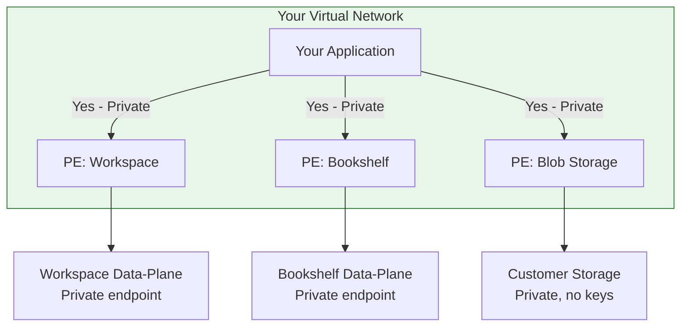

# End-to-end network-hardened deployment

This guide walks you through deploying a complete Microsoft Discovery stack where **all traffic stays within your virtual network**. By the end, your workspace data-plane APIs, bookshelf search, supercomputer jobs, and customer blob storage are all accessible exclusively through private endpoints - with zero public internet exposure.

## What you build



| Component | Network protection | Access path |
|-----------|-------------------|-------------|
| **Workspace data-plane** | Private endpoint to Azure backbone | `{name}.workspace.discovery.azure.com` resolves to private IP |
| **Bookshelf data-plane** | Private endpoint to Azure backbone | `{name}.bookshelf.discovery.azure.com` resolves to private IP |
| **Managed resources** | Network Security Perimeter (NSP) Enforced + MRG private endpoints | Accessible only to Discovery service components |
| **Supercomputer (AKS)** | VNet-injected | Runs in your virtual network subnet, accesses managed resources through private endpoints |
| **Storage (NetApp)** | Delegated subnet | Runs in your VNet through subnet delegation |
| **Customer blob storage** | Private endpoint + no public access + no keys | Accessible only through PE with managed identity RBAC |

## Prerequisites

- An Azure subscription with **Microsoft.Discovery** registered
- Azure CLI 2.50+
- A user-assigned managed identity (UAMI)
- Network hardening prerequisites completed (see [Configure network security](how-to-configure-network-security.md#prerequisites))

## Step 1: Plan your virtual network

Create a virtual network with dedicated subnets for each component:

```azurecli
az network vnet create \
  --resource-group {rg} --name {vnetName} \
  --address-prefixes 10.200.0.0/16 --location {region}
```

Create the subnets:

| Subnet | CIDR | Purpose |
|--------|------|---------|
| `agent-ws` | `10.200.1.0/24` | Workspace agent workloads |
| `workspace-ws` | `10.200.2.0/24` | Workspace services |
| `pe-ws` | `10.200.3.0/27` | Private endpoints (workspace + bookshelf) |
| `bs-search` | `10.200.4.0/27` | Bookshelf search services |
| `sc-aks` | `10.200.6.0/24` | Supercomputer cluster |
| `sc-nodepool` | `10.200.5.0/24` | Supercomputer nodepool |
| `storage-netapp` | `10.200.7.0/24` | NetApp Files (delegated) |
| `pe-storage` | `10.200.11.0/27` | Customer blob storage PE |

```azurecli
az network vnet subnet create --resource-group {rg} --vnet-name {vnetName} --name agent-ws --address-prefixes 10.200.1.0/24
az network vnet subnet create --resource-group {rg} --vnet-name {vnetName} --name workspace-ws --address-prefixes 10.200.2.0/24
az network vnet subnet create --resource-group {rg} --vnet-name {vnetName} --name pe-ws --address-prefixes 10.200.3.0/27
az network vnet subnet create --resource-group {rg} --vnet-name {vnetName} --name bs-search --address-prefixes 10.200.4.0/27
az network vnet subnet create --resource-group {rg} --vnet-name {vnetName} --name sc-aks --address-prefixes 10.200.6.0/24
az network vnet subnet create --resource-group {rg} --vnet-name {vnetName} --name sc-nodepool --address-prefixes 10.200.5.0/24
az network vnet subnet create --resource-group {rg} --vnet-name {vnetName} --name storage-netapp --address-prefixes 10.200.7.0/24
az network vnet subnet create --resource-group {rg} --vnet-name {vnetName} --name pe-storage --address-prefixes 10.200.11.0/27
```

> [!IMPORTANT]
> All subnets must be in the same virtual network so managed resources, supercomputer, and storage can communicate privately through VNet-injected endpoints and private endpoints.

## Step 2: Create the Discovery resource stack

### Supercomputer (VNet-injected)

Create the supercomputer first so it can be referenced by the workspace. The compute cluster is injected directly into your virtual network subnet. Workload traffic stays private.

> [!NOTE]
> **Known limitation:** The supercomputer's AKS API server has a public FQDN. Workload traffic stays within the virtual network, but the Kubernetes API server endpoint is publicly accessible. Private cluster support is planned for a future release.

```azurecli
az rest --method PUT \
  --uri "https://management.azure.com/subscriptions/{sub}/resourceGroups/{rg}/providers/Microsoft.Discovery/supercomputers/{scName}?api-version=2026-02-01-preview" \
  --body '{
    "location": "{region}",
    "properties": {
      "subnetId": "/subscriptions/{sub}/resourceGroups/{rg}/providers/Microsoft.Network/virtualNetworks/{vnet}/subnets/sc-aks",
      "identities": {
        "clusterIdentity": { "id": "{uamiResourceId}" },
        "kubeletIdentity": { "id": "{uamiResourceId}" },
        "workloadIdentities": { "{uamiResourceId}": {} }
      }
    }
  }'
```

Add a nodepool after the supercomputer is provisioned:

```azurecli
az rest --method PUT \
  --uri "https://management.azure.com/subscriptions/{sub}/resourceGroups/{rg}/providers/Microsoft.Discovery/supercomputers/{scName}/nodepools/{nodepoolName}?api-version=2026-02-01-preview" \
  --body '{
    "location": "{region}",
    "properties": { "vmSize": "Standard_D16s_v5", "minNodeCount": 0, "maxNodeCount": 3, "scaleSetPriority": "Regular" }
  }'
```

### Bookshelf (with network isolation)

```azurecli
az rest --method PUT \
  --uri "https://management.azure.com/subscriptions/{sub}/resourceGroups/{rg}/providers/Microsoft.Discovery/bookshelves/{bsName}?api-version=2026-02-01-preview" \
  --body '{
    "location": "{region}",
    "tags": { "networkIsolation": "true", "SkipAssociateKeyVaultToNsp": "true" },
    "properties": {
      "searchSubnetId": "/subscriptions/{sub}/resourceGroups/{rg}/providers/Microsoft.Network/virtualNetworks/{vnet}/subnets/bs-search",
      "privateEndpointSubnetId": "/subscriptions/{sub}/resourceGroups/{rg}/providers/Microsoft.Network/virtualNetworks/{vnet}/subnets/pe-ws",
      "workloadIdentities": { "{uamiResourceId}": {} }
    }
  }'
```

### Workspace (with network isolation)

Create the workspace after the supercomputer so you can include `supercomputerIds` directly:

```azurecli
az rest --method PUT \
  --uri "https://management.azure.com/subscriptions/{sub}/resourceGroups/{rg}/providers/Microsoft.Discovery/workspaces/{wsName}?api-version=2026-02-01-preview" \
  --body '{
    "location": "{region}",
    "tags": { "networkIsolation": "true", "SkipAssociateKeyVaultToNsp": "true" },
    "properties": {
      "agentSubnetId": "/subscriptions/{sub}/resourceGroups/{rg}/providers/Microsoft.Network/virtualNetworks/{vnet}/subnets/agent-ws",
      "privateEndpointSubnetId": "/subscriptions/{sub}/resourceGroups/{rg}/providers/Microsoft.Network/virtualNetworks/{vnet}/subnets/pe-ws",
      "workspaceSubnetId": "/subscriptions/{sub}/resourceGroups/{rg}/providers/Microsoft.Network/virtualNetworks/{vnet}/subnets/workspace-ws",
      "workspaceIdentity": { "id": "{uamiResourceId}" },
      "supercomputerIds": [
        "/subscriptions/{sub}/resourceGroups/{rg}/providers/Microsoft.Discovery/supercomputers/{scName}"
      ]
    }
  }'
```

## Step 3: Create customer private endpoints for data-plane APIs

Create private endpoints so your applications can call workspace and bookshelf APIs without leaving your virtual network:

### Workspace PE

```azurecli
az network private-endpoint create \
  --resource-group {rg} --name pe-workspace \
  --vnet-name {vnet} --subnet pe-ws \
  --private-connection-resource-id "/subscriptions/{sub}/resourceGroups/{rg}/providers/Microsoft.Discovery/workspaces/{wsName}" \
  --group-id workspace --connection-name pe-ws-conn
```

### Bookshelf PE

```azurecli
az network private-endpoint create \
  --resource-group {rg} --name pe-bookshelf \
  --vnet-name {vnet} --subnet pe-ws \
  --private-connection-resource-id "/subscriptions/{sub}/resourceGroups/{rg}/providers/Microsoft.Discovery/bookshelves/{bsName}" \
  --group-id bookshelf --connection-name pe-bs-conn
```

### Configure private DNS

Create DNS zones and link them to your virtual network so your applications resolve Discovery FQDNs to private IPs:

```azurecli
# Workspace DNS
az network private-dns zone create --resource-group {rg} --name privatelink.workspace.discovery.azure.com
az network private-dns link vnet create --resource-group {rg} \
  --zone-name privatelink.workspace.discovery.azure.com \
  --name link-vnet --virtual-network {vnet} --registration-enabled false
az network private-endpoint dns-zone-group create --resource-group {rg} \
  --endpoint-name pe-workspace --name default \
  --private-dns-zone privatelink.workspace.discovery.azure.com --zone-name workspace

# Bookshelf DNS
az network private-dns zone create --resource-group {rg} --name privatelink.bookshelf.discovery.azure.com
az network private-dns link vnet create --resource-group {rg} \
  --zone-name privatelink.bookshelf.discovery.azure.com \
  --name link-vnet --virtual-network {vnet} --registration-enabled false
az network private-endpoint dns-zone-group create --resource-group {rg} \
  --endpoint-name pe-bookshelf --name default \
  --private-dns-zone privatelink.bookshelf.discovery.azure.com --zone-name bookshelf
```

## Step 4: Add network-hardened customer blob storage

For workloads that need access to customer data (training data, documents), create a fully locked-down Azure Blob Storage account accessible only through your virtual network:

### Create the storage account (no public access, no keys)

```azurecli
az storage account create --resource-group {rg} \
  --name {storageAccountName} --location {region} \
  --sku Standard_LRS --kind StorageV2 \
  --min-tls-version TLS1_2 \
  --allow-blob-public-access false \
  --public-network-access Disabled \
  --allow-shared-key-access false \
  --default-action Deny --https-only true
```

### Assign RBAC (managed identity, no keys)

```azurecli
az role assignment create \
  --assignee-object-id {uamiPrincipalId} \
  --assignee-principal-type ServicePrincipal \
  --role "Storage Blob Data Contributor" \
  --scope "/subscriptions/{sub}/resourceGroups/{rg}/providers/Microsoft.Storage/storageAccounts/{storageAccountName}"
```

### Create PE for blob access from your virtual network

```azurecli
az network private-endpoint create \
  --resource-group {rg} --name pe-blob-storage \
  --vnet-name {vnet} --subnet pe-storage \
  --private-connection-resource-id "/subscriptions/{sub}/resourceGroups/{rg}/providers/Microsoft.Storage/storageAccounts/{storageAccountName}" \
  --group-id blob --connection-name pe-blob-conn
```

### Register the storage with Discovery

Create a Discovery storage container resource that references your blob storage:

```azurecli
az rest --method PUT \
  --uri "https://management.azure.com/subscriptions/{sub}/resourceGroups/{rg}/providers/Microsoft.Discovery/storageContainers/{scName}?api-version=2026-02-01-preview" \
  --body '{
    "location": "{region}",
    "properties": {
      "storageStore": {
        "kind": "AzureStorageBlob",
        "storageAccountId": "/subscriptions/{sub}/resourceGroups/{rg}/providers/Microsoft.Storage/storageAccounts/{storageAccountName}"
      }
    }
  }'
```

> [!TIP]
> The same UAMI used for the workspace can access the blob storage through RBAC — no storage keys are needed. All access flows through the private endpoint within your virtual network.

## Step 5: Verify end-to-end network isolation

From a compute resource inside your virtual network (such as a VM with no public IP), verify that all traffic stays private:

### Verify workspace data-plane resolves to private IP

```bash
nslookup {wsName}.workspace.discovery.azure.com
# Expected: Address pointing to a private IP (10.x.x.x)
```

### Verify bookshelf data-plane resolves to private IP

```bash
nslookup {bsName}.bookshelf.discovery.azure.com
# Expected: Address pointing to a private IP (10.x.x.x)
```

### Verify blob storage resolves to private IP

```bash
nslookup {storageAccountName}.blob.core.windows.net
# Expected: CNAME to privatelink.blob.core.windows.net pointing to private IP
```

### Verify TCP connectivity to all private endpoints

```bash
curl -sSf --connect-timeout 5 https://{wsName}.workspace.discovery.azure.com -o /dev/null && echo "Workspace: Connected" || echo "Workspace: Failed"
curl -sSf --connect-timeout 5 https://{bsName}.bookshelf.discovery.azure.com -o /dev/null && echo "Bookshelf: Connected" || echo "Bookshelf: Failed"
curl -sSf --connect-timeout 5 https://{storageAccountName}.blob.core.windows.net -o /dev/null && echo "Blob Storage: Connected" || echo "Blob Storage: Failed"
# Expected: Connected for all
```

## How traffic flows end to end

The following table shows how each traffic path stays within your virtual network:

| Traffic path | Source | Destination | Network mechanism | Public internet? |
|-------------|--------|-------------|-------------------|-----------------|
| **Your app to Workspace API** | VM in virtual network | Workspace PE (private IP) | Private endpoint to Azure backbone | No - No |
| **Your app to Bookshelf API** | VM in virtual network | Bookshelf PE (private IP) | Private endpoint to Azure backbone | No - No |
| **Your app to Blob storage** | VM in virtual network | Blob PE (private IP) | Private endpoint | No - No |
| **Workspace to managed databases** | Agent workload | Managed resource PE | MRG private endpoint (autoprovisioned) | No - No |
| **Workspace to AI services** | Agent workload | Managed resource PE | MRG private endpoint (autoprovisioned) | No - No |
| **Workspace to customer blob** | Agent workload | Blob PE | UAMI + RBAC through private endpoint | No - No |
| **Bookshelf to AI Search index** | Bookshelf workload | Managed Search PE | MRG private endpoint (autoprovisioned) | No - No |
| **Bookshelf to AI services** | Bookshelf workload | Managed AI Foundry PE | MRG private endpoint (autoprovisioned) | No - No |
| **Bookshelf to customer blob** | Bookshelf workload | Blob PE | UAMI + RBAC through private endpoint | No - No |
| **Supercomputer to managed resources** | AKS pod in virtual network | Managed resource PE | VNet-injected + MRG private endpoint | No - No |
| **Supercomputer to customer blob** | AKS pod in virtual network | Blob PE | UAMI + RBAC through private endpoint | No - No |

### How workspace agents access customer data

When a workspace agent runs a tool or processes a request, it accesses customer blob storage **entirely through your VNet**:

1. The agent workload (running in a VNet-injected environment) resolves the storage FQDN through private DNS to private IP
2. The request flows through the blob storage private endpoint within your virtual network
3. Authentication uses the workspace's managed identity (UAMI) with RBAC — no storage keys

The same UAMI that owns the workspace can be granted `Storage Blob Data Contributor` on your storage account, enabling seamless private access without key management.

### How bookshelf accesses knowledge base data

When a bookshelf indexes or retrieves data, all traffic stays private:

- **AI Search** - The bookshelf's managed AI Search service is provisioned with a private endpoint in the managed resource group. All indexing and query traffic flows through this private endpoint within your virtual network. Search never exposes a public endpoint when network isolation is enabled.
- **AI services (embeddings)** - The bookshelf's AI Foundry instance generates embeddings for document processing. It's accessed through a managed private endpoint — no public internet traversal.
- **Customer blob storage** - When the bookshelf ingests data from your blob storage, it uses the workload identity (UAMI) to authenticate through RBAC and routes traffic through the blob private endpoint in your virtual network.

> [!TIP]
> By using the same UAMI across workspace, bookshelf, and supercomputer — and assigning it `Storage Blob Data Contributor` on your storage account — all three components can access customer data through the same private endpoint path with zero keys and zero public access.

> [!IMPORTANT]
> After verifying connectivity, consider [disabling public network access](how-to-configure-network-security.md#disable-public-network-access-optional) on your workspace and bookshelf to ensure that only private endpoint traffic is accepted.

## Security summary

When you complete this deployment, you have:

- Yes - **Zero public endpoints** - all managed resources have `publicNetworkAccess: Disabled` or `SecuredByPerimeter`
- Yes - **Zero access keys** - customer storage uses managed identity with RBAC only
- Yes - **Zero internet traversal** - all data-plane traffic stays on Azure backbone through Private Link
- Yes - **Defense in depth** - NSP (network perimeter) + PE (private connectivity) + virtual network injection (compute isolation) + RBAC (identity-based access)

## Appendix

### SkipAssociateKeyVaultToNsp tag

The `SkipAssociateKeyVaultToNsp` tag is required only for Microsoft internal subscriptions to avoid conflicts with existing NSP associations. External customer subscriptions don't need this tag.

## Next steps

- [Configure network security](how-to-configure-network-security.md) - detailed network hardening and PE setup
- [Manage workspaces](how-to-manage-workspaces.md)
- [Create a bookshelf](how-to-create-bookshelf.md)
- [Configure network security](how-to-configure-network-security.md)
