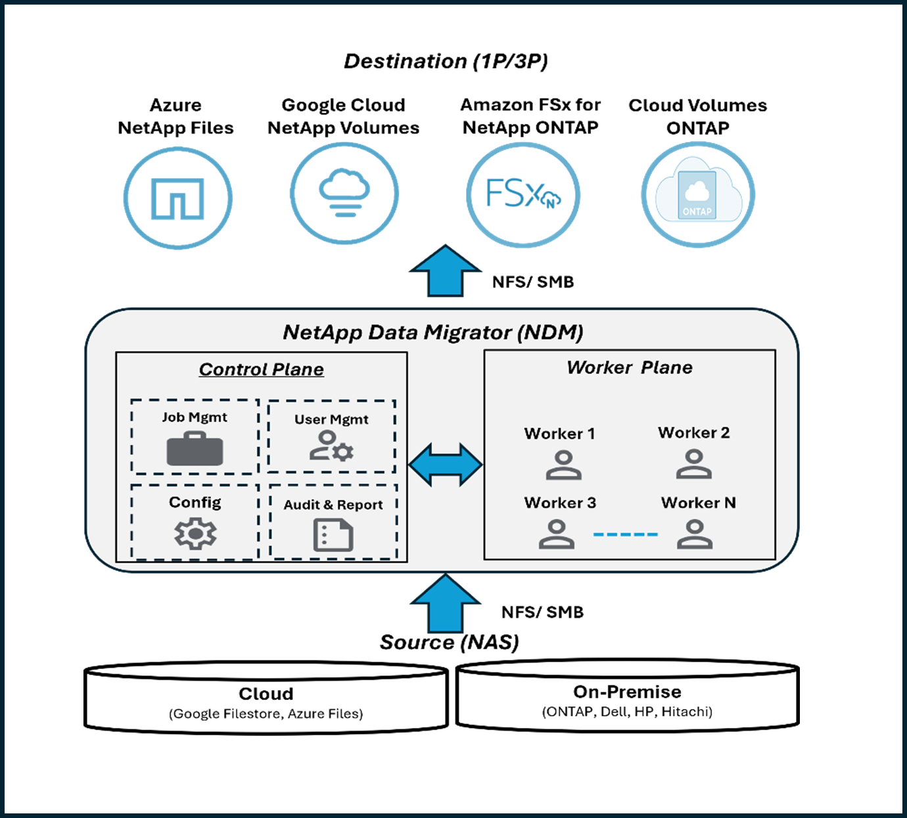
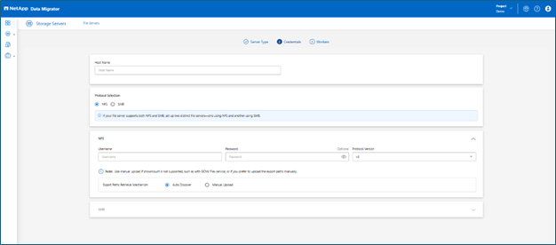
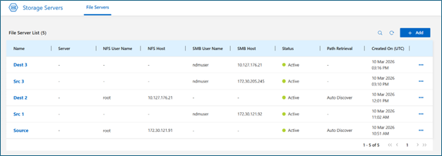
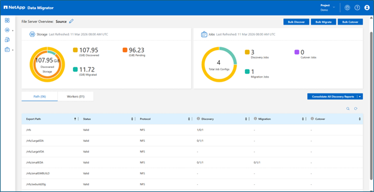
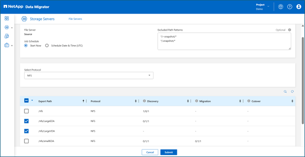
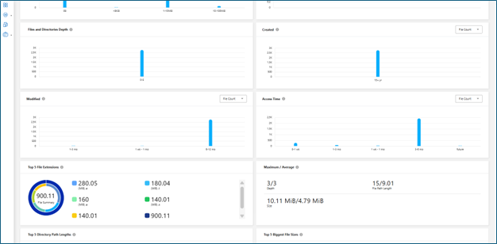

# Migrate data to Azure NetApp Files with NetApp Data Migrator (NDM)

This article helps you deploy and use NetApp Data Migrator (NDM) to migrate unstructured file data to Azure NetApp Files (ANF). It outlines prerequisites, Azure-specific deployment steps, file-server configuration, migration planning, execution, and operational guidance for successful end-to-end data movement into ANF.

NDM provides an intuitive UI and API-driven workflow that enables you to discover, analyze, and migrate NFS or SMB datasets from on-premises or third-party file servers into Azure NetApp Files. It supports baseline data transfer, incremental sync, and a controlled cutover phase to minimize downtime. NDM also generates Chain of Custody (CoC) reports to validate post-migration data integrity.

---

## NetApp Data Migrator Architecture

NetApp Data Migrator (NDM) operates through a two-plane architecture consisting of a worker plane and a control plane.

- The worker plane consists of worker VMs deployed in your environment that scan and migrate files and directories, sync metadata, perform incremental syncs, and send high-level statistics back to the control plane.
- The control plane serves as the central management layer, providing UI-based access to configure and manage projects, users, jobs, workers, and file servers.

---

## Getting started with NetApp Data Migrator

To begin using NetApp Data Migrator, please start by completing the following form:
https://forms.office.com/r/KgeaNh7g4g

Once the form is submitted, NetApp specialists will connect with you to provision your NDM application and walk you through the installation steps. With the required prerequisites in place, the setup process is straightforward and typically takes about 30 minutes.

---

## Add source and destination file servers

Once the NDM setup is complete, the next step is to add both the source and destination file servers. This involves a three-step process:

1. Assigning a name to the file server  
2. Providing the NFS/SMB configuration details  
3. Associating the appropriate worker nodes

Ensure that at least one common worker is associated with both the source and destination file servers.

Once the file server creation is complete, it will be added to the file server list. The status may take a few seconds to update to **Active**. After the status changes to Active, the setup is complete and you can proceed with the workflows.

Once the file server status changes to Active, all export paths or shares under that file server become accessible. The file-server overview page also provides a high-level dashboard showing the progress so far.

## Discovery

To start discovery, click **Bulk Discover** from the top right. This allows you to discover multiple export paths or shares at once.

Once the discovery job is completed, NDM generates a discovery report to help you plan your migration.

## Migration

The next step after discovery is migration. Click **Bulk Migrate** from the file-server page. NDM provides multiple options to configure your migration job.

You can either:
- Migrate the entire volume, or  
- Perform migration at the directory level

Configure your job to run incrementally so that the destination remains up to date with the source. This helps enable shorter cutover times.

Once the migration job is complete, NDM allows you to download a **Chain of Custody (CoC)** report. This audit report provides a complete list of all files migrated as part of the job run.

---

## Cutover

The final step of the migration process is **Bulk Cutover**.

NDM performs a final synchronization between source and destination as part of the cutover process. Users receive a comprehensive report listing all files migrated for that path pair across all migration and cutover runs, providing a complete audit trail.

Once you are satisfied with the report, you can successfully switch over to the destination.

