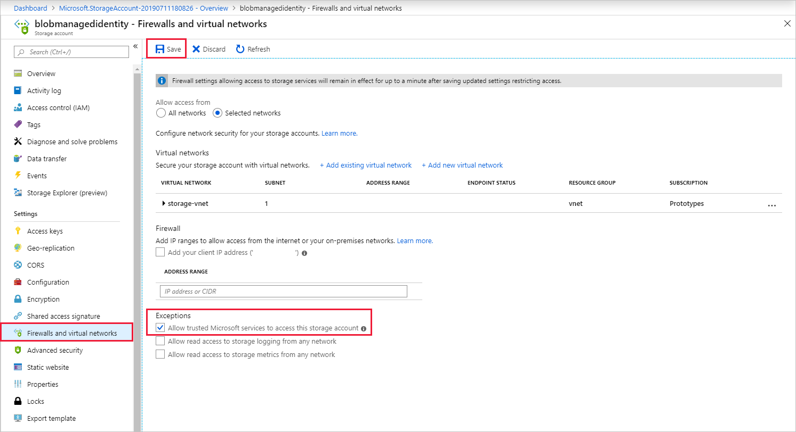

# Use managed identity to authenticate your Azure Stream Analytics job to Azure Blob Storage

When you use [managed identity authentication](../active-directory/managed-identities-azure-resources/overview.md) for output to Azure Blob storage, Stream Analytics jobs get direct access to a storage account without using a connection string. This feature improves security and enables you to write data to a storage account in a virtual network (VNET) within Azure.

This article shows you how to enable managed identity for the Blob outputs of a Stream Analytics job through the Azure portal and through an Azure Resource Manager deployment.

## Create the Stream Analytics job by using the Azure portal

First, create a managed identity for your Azure Stream Analytics job.  

1. In the Azure portal, open your Azure Stream Analytics job.  

1. From the left navigation menu, select **Managed Identity** located under *Configure*. Then, check the box next to **Use System-assigned Managed Identity** and select **Save**.

   :::image type="content" source="media/event-hubs-managed-identity/system-assigned-managed-identity.png" alt-text="System assigned managed identity":::  

1. Azure creates a service principal for the Stream Analytics job's identity in Microsoft Entra ID. Azure manages the life cycle of the newly created identity. When you delete the Stream Analytics job, Azure automatically deletes the associated identity (that is, the service principal).  

   When you save the configuration, the Object ID (OID) of the service principal appears as the Principal ID as shown in the following section:  

   :::image type="content" source="media/event-hubs-managed-identity/principal-id.png" alt-text="Principal ID":::

   The service principal has the same name as the Stream Analytics job. For example, if the name of your job is `MyASAJob`, the name of the service principal is also `MyASAJob`. 


## Azure Resource Manager deployment

By using Azure Resource Manager, you can fully automate the deployment of your Stream Analytics job. You can deploy Resource Manager templates by using either Azure PowerShell or the [Azure CLI](/cli/azure/). The following examples use the Azure CLI.


1. Create a **Microsoft.StreamAnalytics/streamingjobs** resource with a Managed Identity by including the following property in the resource section of your Resource Manager template:

    ```json
    "Identity": {
      "Type": "SystemAssigned",
    },
    ```

   This property tells Azure Resource Manager to create and manage the identity for your Stream Analytics job. The following example Resource Manager template deploys a Stream Analytics job with Managed Identity enabled and a Blob output sink that uses Managed Identity:

    ```json
    {
        "$schema": "http://schema.management.azure.com/schemas/2015-01-01/deploymentTemplate.json#",
        "contentVersion": "1.0.0.0",
        "resources": [
            {
                "apiVersion": "2017-04-01-preview",
                "name": "MyStreamingJob",
                "location": "[resourceGroup().location]",
                "type": "Microsoft.StreamAnalytics/StreamingJobs",
                "identity": {
                    "type": "systemAssigned"
                },
                "properties": {
                    "sku": {
                        "name": "standard"
                    },
                    "outputs":[
                        {
                            "name":"output",
                            "properties":{
                                "serialization": {
                                    "type": "JSON",
                                    "properties": {
                                        "encoding": "UTF8"
                                    }
                                },
                                "datasource":{
                                    "type":"Microsoft.Storage/Blob",
                                    "properties":{
                                        "storageAccounts": [
                                            { "accountName": "MyStorageAccount" }
                                        ],
                                        "container": "test",
                                        "pathPattern": "segment1/{date}/segment2/{time}",
                                        "dateFormat": "yyyy/MM/dd",
                                        "timeFormat": "HH",
                                        "authenticationMode": "Msi"
                                    }
                                }
                            }
                        }
                    ]
                }
            }
        ]
    }
    ```

    You can deploy the preceding job to the resource group **ExampleGroup** by using the following Azure CLI command:

    ```azurecli
    az deployment group create --resource-group ExampleGroup -template-file StreamingJob.json
    ```

1. After you create the job, use Azure Resource Manager to retrieve the job's full definition.

    ```azurecli
    az resource show --ids /subscriptions/{SUBSCRIPTION_ID}/resourceGroups/{RESOURCE_GROUP}/providers/Microsoft.StreamAnalytics/StreamingJobs/{RESOURCE_NAME}
    ```

    The preceding command returns a response like the following:

    ```json
    {
        "id": "/subscriptions/{SUBSCRIPTION_ID}/resourceGroups/{RESOURCE_GROUP}/providers/Microsoft.StreamAnalytics/streamingjobs/{RESOURCE_NAME}",
        "identity": {
            "principalId": "{PRINCIPAL_ID}",
            "tenantId": "{TENANT_ID}",
            "type": "SystemAssigned",
            "userAssignedIdentities": null
        },
        "kind": null,
        "location": "West US",
        "managedBy": null,
        "name": "{RESOURCE_NAME}",
        "plan": null,
        "properties": {
            "compatibilityLevel": "1.0",
            "createdDate": "2019-07-12T03:11:30.39Z",
            "dataLocale": "en-US",
            "eventsLateArrivalMaxDelayInSeconds": 5,
            "jobId": "{JOB_ID}",
            "jobState": "Created",
            "jobStorageAccount": null,
            "jobType": "Cloud",
            "outputErrorPolicy": "Stop",
            "package": null,
            "provisioningState": "Succeeded",
            "sku": {
                "name": "Standard"
            }
        },
        "resourceGroup": "{RESOURCE_GROUP}",
        "sku": null,
        "tags": null,
        "type": "Microsoft.StreamAnalytics/streamingjobs"
    }
    ```

   Take note of the **principalId** from the job's definition, which identifies your job's Managed Identity within Microsoft Entra ID and is used in the next step to grant the Stream Analytics job access to the storage account.

1. Now that you created the job, see the [Give the Stream Analytics job access to your storage account](#give-the-stream-analytics-job-access-to-your-storage-account) section of this article.


## Give the Stream Analytics job access to your storage account

You can give your Stream Analytics job two levels of access:

1. **Container level access:** This access level grants the job access to a specific existing container.
1. **Account level access:** This access level grants the job general access to the storage account, including the ability to create new containers.

Unless you need the job to create containers, choose **Container level access** to grant the job the minimum level of access required. The following sections explain both options for the Azure portal and the command line.

> [!NOTE]
> Due to global replication or caching latency, revoking or granting permissions might take some time. Changes should appear within eight minutes.

### Grant access through the Azure portal

#### Container level access

1. Go to the container's configuration pane in your storage account.

1. Select **Access control (IAM)**.

1. Select **Add** > **Add role assignment** to open the **Add role assignment** page.

1. Assign the following role. For detailed steps, see [Assign Azure roles using the Azure portal](/azure/role-based-access-control/role-assignments-portal).

    | Setting | Value |
    | --- | --- |
    | Role | Storage Blob Data Contributor |
    | Assign access to | User, group, or service principal |
    | Members | \<Name of your Stream Analytics job> |

    

#### Account level access

1. Go to your storage account.

1. Select **Access control (IAM)**.

1. Select **Add** > **Add role assignment** to open the **Add role assignment** page.

1. Assign the following role. For detailed steps, see [Assign Azure roles using the Azure portal](/azure/role-based-access-control/role-assignments-portal).

    | Setting | Value |
    | --- | --- |
    | Role | Storage Blob Data Contributor |
    | Assign access to | User, group, or service principal |
    | Members | \<Name of your Stream Analytics job> |

    

### Grant access via the command line

#### Container level access

To give access to a specific container, run the following command using the Azure CLI:

   ```azurecli
   az role assignment create --role "Storage Blob Data Contributor" --assignee <principal-id> --scope /subscriptions/<subscription-id>/resourcegroups/<resource-group>/providers/Microsoft.Storage/storageAccounts/<storage-account>/blobServices/default/containers/<container-name>
   ```

#### Account level access

To give access to the entire account, run the following command using the Azure CLI:

   ```azurecli
   az role assignment create --role "Storage Blob Data Contributor" --assignee <principal-id> --scope /subscriptions/<subscription-id>/resourcegroups/<resource-group>/providers/Microsoft.Storage/storageAccounts/<storage-account>
   ```
   
## Create a blob input or output  

Now that your managed identity is configured, you're ready to add the blob resource as an input or output to your Stream Analytics job.

1. In the output properties window of the Azure Blob storage output sink, select the Authentication mode drop-down and choose **Managed Identity**. For information regarding the other output properties, see [Understand outputs from Azure Stream Analytics](./stream-analytics-define-outputs.md). When you finish, select **Save**.

   


## Enable VNET access

When you configure your storage account's **Firewalls and virtual networks**, you can optionally allow in network traffic from other trusted Microsoft services. When Stream Analytics authenticates by using Managed Identity, it provides proof that the request is originating from a trusted service. The following instructions explain how to enable this VNET access exception.

1.    Go to the **Firewalls and virtual networks** pane within the storage account's configuration pane.
1.    Ensure the **Allow trusted Microsoft services to access this storage account** option is enabled.
1.    If you enabled it, select **Save**.

   

## Remove Managed Identity

The Managed Identity you create for a Stream Analytics job is deleted only when you delete the job. You can't delete the Managed Identity without deleting the job. If you no longer want to use the Managed Identity, you can change the authentication method for the output. The Managed Identity continues to exist until you delete the job, and it's used if you decide to use Managed Identity authentication again.

## Limitations
The current limitations of this feature include:

1. Classic Azure Storage accounts.

1. Azure accounts without Microsoft Entra ID.

1. Multi-tenant access isn't supported. The service principal created for a given Stream Analytics job must reside in the same Microsoft Entra tenant in which you created the job, and you can't use it with a resource that resides in a different Microsoft Entra tenant.


## Next steps

* [Understand outputs from Azure Stream Analytics](./stream-analytics-define-outputs.md)
* [Azure Stream Analytics custom blob output partitioning](./stream-analytics-custom-path-patterns-blob-storage-output.md)
